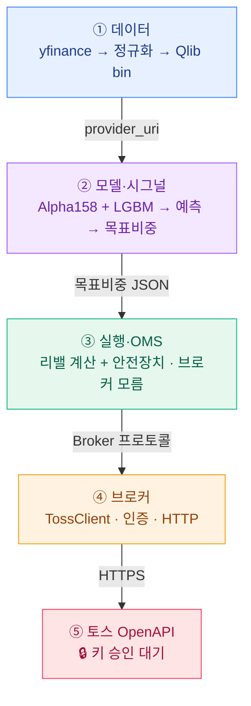
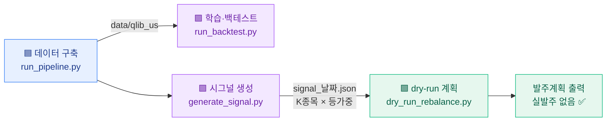
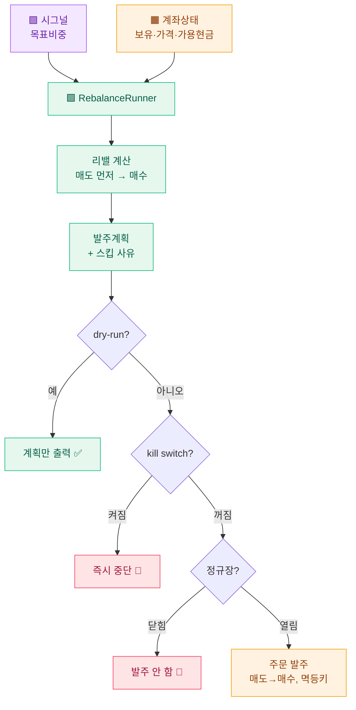
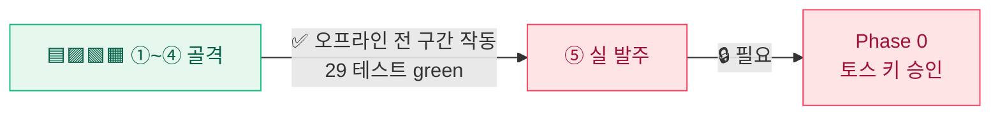

# 아키텍처 & 실행 흐름

> 전체 계획과 의사결정은 [qlib-toss.md](qlib-toss.md), 진행 상태는 [README.md](README.md)에 있다.
> 이 문서는 시스템의 **구조**와 **데이터가 흐르는 순서**를 그림 중심으로 설명한다.

## 먼저, 비유로

전체 그림은 주방에 빗대면 쉽다.

| 단계 | 비유 | 이 프로젝트 |
|------|------|-------------|
| 재료 | 신선한 식재료 준비 | **데이터** (yfinance → Qlib bin) |
| 요리사 | 뭘 만들지 정함 | **모델** (예측 → 살 종목·비중) |
| 서빙 담당 | 주문서대로 접시 구성 | **실행** (목표 vs 보유 diff → 발주계획) |
| 전달 창구 | 손님에게 실제로 내감 | **브로커/토스** (실 발주) |

qlib(요리사)은 **"무엇을 살지"까지만** 판단한다. **"어떻게 주문할지"(서빙과 전달)는 qlib이 다루지 않아 직접 구현**했다.
전략은 주간 리밸런싱, 롱온리, 상위 K종목 등가중이다.

**범례**  🟦 데이터  🟪 모델  🟩 실행  🟧 브로커  🟥 막힘(키 대기)

---

## 레이어 (한 줄로 흐른다)



핵심은 의존 방향이다. **③ 실행 계층은 ④ 브로커를 직접 참조하지 않는다.** 대신 ③이 `Broker` 인터페이스를 정의하고 ④(토스)가 이를 구현한다. 덕분에 실제 API 없이도 가짜 브로커를 끼워 전 구간을 테스트할 수 있고, 나중에 브로커를 교체할 여지도 남는다.

| 레이어 | 폴더 | 핵심 파일 |
|--------|------|-----------|
| 🟦 ① 데이터 | `scripts/data_pipeline/` | `run_pipeline`, `01~04_*`, `gen_sp500_universe` |
| 🟪 ② 모델 | `scripts/model_backtest/` | `run_backtest`, `generate_signal`, `*.yaml` |
| 🟩 ③ 실행 | `src/execution/` | `runner`, `rebalance`, `safety`, `interface` |
| 🟧 ④ 브로커 | `src/toss/` | `broker`, `client`, `auth`, `config` |

---

## 흐름 ① — 지금 동작하는 부분 (오프라인, 토스 API 불필요)

데이터 구축부터 발주 **계획** 산출까지, 토스 API 없이 전 과정이 동작한다.



| 단계 | 명령 | 결과 |
|------|------|------|
| 데이터 | `run_pipeline.py` | S&P500 503+SPY bin |
| 학습 | `run_backtest.py --config …sp500` | IC 0.012 *(엣지 미검출)* |
| 시그널 | `generate_signal.py --topk 20` | 목표비중 JSON |
| dry-run | `dry_run_rebalance.py` | 발주계획 20건 · $700 |

---

## 흐름 ② — 실제 리밸런싱 (`RebalanceRunner`)

시그널과 계좌 상태를 받아 발주계획을 만든다. 이후 **dry-run이면 계획만 출력하고, 실전이면 안전장치를 모두 통과했을 때만 발주한다.**



**리밸 계산의 네 가지 규칙** (`compute_rebalance`):
- 🔻 **매도 먼저** — 빠질 종목을 전량 팔고 초과분을 정리한 뒤에 매수한다 (매수 자금 확보).
- 💵 **가용현금 한도** — 매수는 현재 현금 범위 안에서만 하고, 넘치는 분량은 다음 주기로 미룬다 (매도대금 T+N 정산 반영).
- 🚫 **최소금액 미달 스킵** — 최소 주문금액에 못 미치는 주문은 건너뛴다.
- 🔁 **멱등키** — 같은 날·종목·방향이면 주문번호가 같아, 재시도하거나 도중에 멈췄다 다시 실행해도 중복 발주되지 않는다.

---

## 디렉토리 한눈에

```
universe/     티커 (sp500_full 503+SPY · sp500_pilot 41)
scripts/
  data_pipeline/    🟦 데이터: 수집→정규화→dump→검증
  model_backtest/   🟪 모델: 학습·백테스트·시그널·dry-run
  toss_probe/       Phase 0 실측 CLI (키 승인 후)
src/
  execution/    🟩 리밸·안전장치 (브로커 비의존)
  toss/         🟧 토스 HTTP·인증
tests/          단위테스트 (pytest, 29개)
vendor/         qlib dump_bin.py (수정 금지)
data/·signals/  (gitignore) 생성물
```

---

## 지금 상태



- ✅ **데이터 → 예측 → 시그널 → 발주계획**까지 오프라인 전 구간 검증 완료.
- ⚠️ 모델에서 유의미한 엣지는 검출되지 않았다. 따라서 현재 단계의 목적은 수익이 아니라 **학습과 시스템 완성**이다.
- 🔒 **실 발주는 토스 키 발급(Phase 0)을 기다린다.** 키가 풀리면 응답 필드 확정, 개선11(401 재시도), 실측 비용 기반 재판정, dry-run에서 소액 실발주로 이어진다.

### 개선(N) 위치
| 번호 | 내용 | 위치 |
|------|------|------|
| 1 | 자금순환·부분이월 | `execution/rebalance` |
| 4 | dry-run·kill switch·서킷브레이커 | `execution/safety`·`runner` |
| 5 | 멱등키 | `execution/rebalance` |
| 8 | 최소금액 스킵 | `execution/rebalance` |
| 10 | 예외화(TossError) | `toss/errors` |
| 13 | 응답본문 누설 방지 | `toss/auth`·`toss/errors` |
| 11 | 401 재시도 | 🔒 Phase 5 (키 승인 후) |
