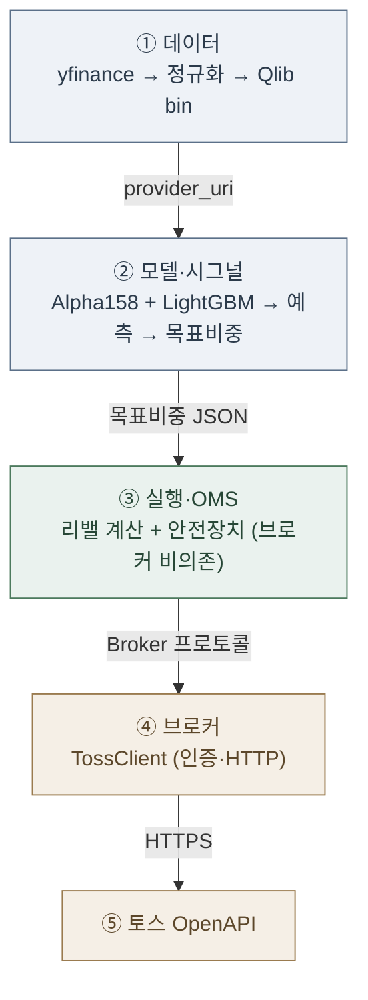
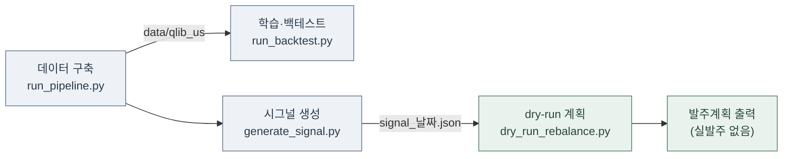
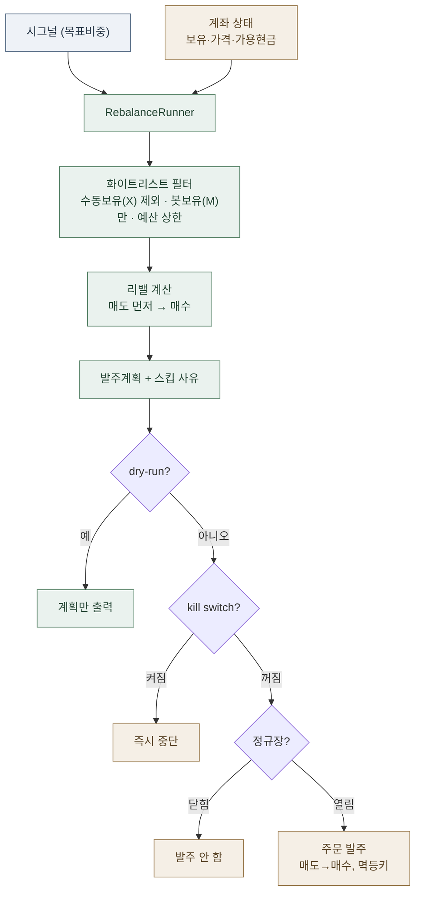

# qlib-toss

Qlib으로 미국주식을 예측·백테스트하고, 토스증권 OpenAPI로 주간 리밸런싱을 자동 발주하는 개인 프로젝트.

> 상세 계획·의사결정은 [qlib-toss.md](qlib-toss.md) 참고(작업계획서).
> $700 규모의 **학습·검증 목적** 프로젝트입니다. 실전 수익을 보장하지 않습니다.

시스템은 두 부분으로 나뉜다.

- **리서치**: qlib으로 미국주식을 예측한다. 어떤 종목을 어느 비중으로 담을지 정하는 데까지다.
- **실행**: 그 목표 포트폴리오를 현재 보유와 비교해 발주 계획으로 바꾸고, 토스증권에 주문을 낸다.

qlib은 예측까지만 담당한다(주문 생성은 지원하지 않는다). 그래서 발주 계층은 직접 구현했다.
전략은 주간 리밸런싱, 롱온리, 상위 K종목 등가중이다.

## 개요

| 항목 | 값 |
|------|-----|
| 시장 / 유니버스 | 미국주식 / S&P 500 |
| 팩터 / 모델 | Alpha158 / LightGBM |
| 포트폴리오 | TopkDropout, 롱온리, K=15~20 |
| 리밸런싱 | 주간 |
| 발주 | 토스증권 OpenAPI (소수점 금액주문) |

## 개발 환경

- macOS (Apple Silicon) + pyenv
- Python 3.10.13 (`.python-version`)

```bash
brew install libomp                        # LightGBM OpenMP 런타임
python -m venv .venv                        # pyenv 3.10.13 기준
.venv/bin/python -m pip install -r requirements.txt
.venv/bin/python -c "import qlib, lightgbm, xgboost"   # 검증
```

## 아키텍처



의존 방향이 핵심이다. ③ 실행 계층은 ④ 브로커를 직접 참조하지 않는다. ③이 `Broker` 인터페이스를 정의하고 ④(토스)가 이를 구현한다. 실제 API 없이 가짜 브로커를 끼워 전 구간을 테스트할 수 있고, 브로커를 교체할 여지도 남는다.

| 레이어 | 폴더 | 핵심 파일 |
|--------|------|-----------|
| ① 데이터 | `scripts/data_pipeline/` | `run_pipeline`, `01~04_*`, `gen_sp500_universe` |
| ② 모델 | `scripts/model_backtest/` | `run_backtest`, `generate_signal`, `*.yaml` |
| ③ 실행 | `src/execution/` | `runner`, `rebalance`, `safety`, `interface`, `managed` |
| ④ 브로커 | `src/toss/` | `broker`, `client`, `auth`, `config`, `errors` |

### 흐름 ① — 오프라인 (토스 API 불필요)

데이터 구축부터 발주 계획 산출까지 토스 API 없이 동작한다.



| 단계 | 명령 | 결과 |
|------|------|------|
| 데이터 | `run_pipeline.py` | S&P500 503+SPY bin |
| 학습 | `run_backtest.py --config …sp500` | IC 0.012 (엣지 미검출) |
| 시그널 | `generate_signal.py --topk 20` | 목표비중 JSON |
| dry-run | `dry_run_rebalance.py` | 발주계획 20건, $700 |

### 흐름 ② — 리밸런싱 (`RebalanceRunner`)

시그널과 계좌 상태를 받아 발주계획을 만든다. dry-run이면 계획만 출력하고, 실전이면 안전장치를 모두 통과했을 때만 발주한다.



리밸 계산 규칙 (`compute_rebalance`):

- 매도 먼저: 빠질 종목을 전량 팔고 초과분을 정리한 뒤 매수한다(매수 자금 확보).
- 가용현금 한도: 매수는 현재 현금 범위 안에서만 하고, 넘치는 분량은 다음 주기로 미룬다(매도대금 T+N 정산 반영).
- 최소금액 미달 스킵: 최소 주문금액에 못 미치는 주문은 건너뛴다.
- 매도 sellable 상한: T+N 미결제분을 초과해 팔지 않도록 매도가능수량으로 상한.
- 멱등키: 같은 날·종목·방향이면 주문번호가 같아, 재시도하거나 도중에 멈췄다 다시 실행해도 중복 발주되지 않는다.
- 화이트리스트(개선14): 사용자가 미리 보유한 종목(X)은 매매하지 않고 봇이 산 종목(M)만 리밸한다. 매수는 예산 상한 안에서만 → 사용자 종목·현금 보호.

## 용어

| 용어 | 뜻 |
|------|-----|
| 유니버스 | 매매 후보 종목 집합. 여기선 S&P500. |
| 팩터 / Alpha158 | 주가·거래량에서 뽑아낸 158개 수치 지표. 모델의 입력. |
| 모델 (LightGBM) | 팩터를 보고 다음 주 상대 수익률을 예측하는 학습 알고리즘. |
| 시그널 | 모델 예측을 "이 종목들을 이 비중으로 담아라"로 정리한 목표 포트폴리오(JSON 파일). |
| 목표비중 | 종목별로 얼마씩 담을지의 비율(합 = 1). |
| 롱온리 | 매수만 함. 공매도 없음. |
| 등가중 | 고른 K종목에 자금을 똑같이 나눠 담음. |
| 리밸런싱 | 주기적으로 현재 보유를 목표비중에 맞게 다시 맞추는 것(팔 것 팔고 살 것 삼). |
| 백테스트 | 과거 데이터로 전략을 모의 실행해 성과를 가늠하는 것. |
| IC / RankIC | 예측과 실제 수익이 얼마나 맞는지 나타내는 예측력 지표. 높을수록 좋고, 대략 0.02 이상이면 쓸 만하다. |
| 벤치마크 (SPY) | 성과 비교 기준(S&P500 ETF). 이걸 못 이기면 능동 전략을 할 이유가 약하다. |
| 엣지 | 벤치마크 대비 꾸준히 초과수익을 낼 실질적 우위. |
| OMS (주문관리) | 목표와 보유의 차이를 실제 주문으로 바꾸고 주문 상태를 관리하는 계층. |
| 발주계획 | 이번 리밸런싱에서 실제로 낼 매도·매수 주문 목록. |
| dry-run | 실제 주문은 내지 않고 발주계획만 출력해 확인하는 모드. |
| 멱등키 (clientOrderId) | 같은 주문에 같은 식별자를 붙여, 재시도해도 중복 발주되지 않게 하는 값. |
| T+N | 매도대금이 N일 뒤 정산돼, 판 즉시 그 돈으로 다시 못 사는 것. |
| kill switch / 서킷브레이커 | 비상 정지 장치. 특정 파일이 있으면 즉시 중단(kill switch), 하루 주문·손실 한도를 넘으면 차단(서킷브레이커). |
| 소수점 금액주문 | "35달러어치"처럼 금액 기준으로 소수점 단위까지 매수하는 방식(토스 미국주식). |
| provider_uri | qlib이 데이터를 읽어 가는 폴더 경로(`data/qlib_us`). |
| 화이트리스트 (관리셋 M / 제외셋 X) | 계좌를 사용자 수동 보유와 공유하므로, 봇이 산 종목(M)만 매매하고 사용자가 미리 보유한 종목(X)은 안 건드리는 장치. |
| 예산 상한 (budget_usd) | 봇이 쓸 수 있는 최대 금액. 계좌에 다른 현금이 있어도 이 한도 안에서만 매수. |

### Alpha158 자세히

qlib이 기본 제공하는 피처셋으로, OHLCV(시가·고가·저가·종가·거래량)만으로 계산한 158개 기술적 지표다. 이름의 "158"은 지표 개수를 뜻한다. 재무·뉴스 같은 외부 데이터는 쓰지 않고, 오로지 가격과 거래량에서 뽑아낸다. 크게 세 그룹으로 나뉜다.

| 그룹 | 내용 | 예 |
|------|------|-----|
| K-bar | 하루 봉의 모양(몸통·꼬리 비율) | `KMID`=(종가−시가)/시가, `KUP`=윗꼬리, `KLEN`=고가−저가 |
| Price | 당일 시가·고가·저가·VWAP를 종가로 정규화 | `OPEN0`=시가/종가, `HIGH0`, `VWAP0` |
| Rolling | 여러 기간(5·10·20·30·60일) 창의 추세·변동성·상관·거래량 지표 | `ROC`(수익률), `MA`(이동평균), `STD`(변동성), `RSQR`(추세 적합도), `CORR`(가격-거래량 상관), `WVMA` 등 |

대부분은 Rolling 그룹이다(약 30종 지표 × 5개 기간 ≈ 150개). 요컨대 한 종목의 최근 가격·거래량 패턴을 158개 숫자로 요약한 것이고, 모델(LightGBM)이 이를 입력받아 다음 주 상대수익률을 예측한다. 이 프로젝트에서는 Alpha158이 참조하는 `$vwap`을 yfinance가 제공하지 않아 `(H+L+C)/3`으로 근사했다(개선12).

## 진행 상태

- [x] **Phase 1** 개발 환경 구축 (M1 + pyenv, qlib/lightgbm/xgboost)
- [x] **Phase 0** 토스 실측 완료 (7/7 게이트) — 계좌(accountSeq)·소수점 OK·최소금액 ≤$1·**자동환전 X(선환전 필요)**·**T+2**·rate-limit 6/s·수수료~0.10%·FX~0.03%. `scripts/toss_probe/`
- [x] **Phase 2** 데이터 파이프라인 (S&P500 전체 503+SPY → Qlib bin) — `scripts/data_pipeline/` 참고
- [x] **Phase 3** 모델 학습 + 백테스트 (①배선 ②S&P500 판독 — 엣지 미검출) — `scripts/model_backtest/` 참고
- [x] **Phase 4** 시그널 생성 (4a 목표비중 JSON + 4b dry-run runner) — `scripts/model_backtest/`
- [x] **Phase 5** 토스 발주 어댑터 — 리밸/OMS `src/execution`, 응답필드 실측 확정, 안전장치(개선10/13/14 + sellable 상한·max-loss·주문루프 하드닝·시그널 신선도)
- [ ] **Phase 6~7** 스모크 테스트 + 소액 실전 — USD 선환전 후 소액 실발주 검증

> Phase 3 결론: 베이스라인(Alpha158+LightGBM, 주간, 미국 대형주)에서는 SPY 대비 exploitable 엣지가 검출되지 않았다. **Phase 0 실측 비용(수수료~0.10%·환전~0.03%/편도)을 반영해 재판정한 결과에도 결론은 동일** — 무비용 초과수익이 사실상 0이라 비용을 낮춰도 순초과수익은 음수(연 -5.6%). 병목은 비용이 아니라 신호품질이다. 현 단계 목적은 학습과 시스템 완성이다.

데이터 → 예측 → 시그널 → 발주계획까지 오프라인 전 구간 검증을 마쳤고, Phase 0 실측(실주문 포함)으로 API 동작을 확정했다. ⚠️ **자동환전이 안 되므로 봇 가동 전 KRW→USD 선환전이 필요**하다(USD 잔액 내에서만 매수 = 안전). 남은 것은 소액 스모크(Phase 6)다.

### 개선(N) 항목 위치

| 번호 | 내용 | 위치 |
|------|------|------|
| 1 | 자금순환·부분이월 | `execution/rebalance` |
| 4 | dry-run·kill switch·서킷브레이커 | `execution/safety`, `runner` |
| 5 | 멱등키 | `execution/rebalance` |
| 8 | 최소금액 스킵 | `execution/rebalance` |
| 10 | 예외화(TossError) | `toss/errors` |
| 11 | 401 재시도 | `toss/client` |
| 13 | 응답본문 누설 방지 | `toss/auth`, `toss/errors` |
| 14 | 계좌 공유 안전(화이트리스트·예산상한) | `execution/managed`, `runner` |

## 모델 비교 (Phase 3 판독)

동일 조건(S&P500, 주간 리밸, 라벨 5일 fwd, 비용 0.23%/편도, SPY 벤치)에서 **핸들러·모델만** 바꿔 비교. 판단 기준은 **Rank IC**(신호 예측력)와 **비용후 초과수익·IR**(전략 성과)다.

| 실험 | 핸들러 + 모델 | IC | Rank IC | 초과(비용후,연) | IR | MDD |
|------|--------------|-----|---------|------|-----|-----|
| 베이스라인 | Alpha158 + LightGBM | 0.0121 | 0.0084 | **-5.6%** | -0.35 | -29.0% |
| 실험 (GRU, 4시드 평균) | Alpha360 + GRU | 0.020 | 0.012 | **+11.9%** | 0.71 | -15~-23% |
| └ 4시드 범위 | | 0.009~0.033 | 0.007~0.019 | +7.1~16.5% | 0.45~0.92 | |
| 참고(중국)¹ | qlib CSI300 최고 (HIST/Alpha360) | 0.052 | 0.067 | — | 1.37 | -6.8% |
| 기준 | SPY | — | — | 0 | — | — |

¹ 중국 A주 CSI300 백테스트(20시드)라 미국과 직접 비교 대상이 아니다 — 도달 가능 상한의 감(感)만.

GRU 4시드(2026·42·7·2025) 상세: 초과 각 +10.8/16.5/7.1/13.2%, IR 각 0.71/0.92/0.45/0.77 — **전부 양수**.

**결론 — 신중히**: 앞선 단일시드(+10.8%)를 "노이즈"로 봤으나, 4시드 전부 SPY 초과(+7~16%)·IR 전부 양수라 **시드 변동성은 아니다**. GRU/Alpha360이 무언가를 잡는다. 다만 **"엣지 발견"으로 결론낼 수 없다** — 낙관 편향 3가지가 미제거이기 때문:
1. **생존편향(개선3, 최유력)** — 현 S&P500 구성으로 2023~2026을 백테스트 = 살아남은 승자만 보유. 이것만으로 초과의 상당분 설명 가능.
2. **단일 강세장 레짐** — 2023~2026은 기술주 주도 불장. 약세장 미포함이라 모멘텀/베타 틸트가 이 기간에 통했을 뿐일 수 있다.
3. **겹침 라벨(B2)** — 일간샘플+5일 라벨의 자기상관이 IC를 부풀린다.

Rank IC 0.012는 여전히 modest → 종목선택 알파라기보다 **모멘텀/베타 틸트**(불장에서 SPY보다 공격적이라 더 먹은 것)일 개연성. **진짜 검증엔** point-in-time 유니버스(생존편향 제거) + 섹터/시장 중립화 + 다레짐 walk-forward가 필요하다. 그 전까진 이 +11.9%를 실전 우위로 신뢰하지 않는다.

재현:
```bash
# Alpha158 + LightGBM (베이스라인)
python scripts/model_backtest/run_backtest.py --config workflow_config_alpha158_lgb_sp500.yaml
# Alpha360 + GRU (macOS는 torch↔OpenMP 충돌로 OMP_NUM_THREADS=1 필수)
OMP_NUM_THREADS=1 python scripts/model_backtest/run_experiment.py --config workflow_config_alpha360_gru_sp500.yaml
```

## 디렉토리

```
src/toss/          토스 OpenAPI 브로커 transport (config·auth·client·errors·broker)
src/execution/     리밸런싱·OMS (브로커 비의존: interface·rebalance·safety·runner·managed·orderlog)
scripts/toss_probe/       Phase 0 실측 툴킷 (키 발급 후 순서대로 실행)
scripts/data_pipeline/    Phase 2 데이터 파이프라인 (수집→정규화→dump→검증)
scripts/model_backtest/   Phase 3~4 학습·백테스트·시그널·dry-run (config 구동)
scripts/live/             실 발주 진입점 (dry-run 기본, --confirm 실발주) — Phase 0 키 필요
tests/             단위테스트 (pytest) — toss·rebalance·safety·runner·managed·broker·live
universe/          유니버스 티커 리스트 (S&P500 전체 + 파일럿)
vendor/            외부 원본 파일 (qlib dump_bin.py) — 수정 금지
data/, signals/    (gitignore) 생성물
qlib-toss.md       전체 작업계획서 (Phase 0~7·개선N·API 스펙·의사결정)
requirements.txt   의존성 핀 (재현용)
```

## 보안

- 자격증명은 **`.env`에서만** 읽으며 코드/저장소에 넣지 않는다 (`.env.example` 참고).
- `.env`, `.cache/`(토큰), `phase0-findings.md`(계좌식별자)는 `.gitignore`로 커밋 차단.
- 저장소는 **Private** 권장.
- **계좌 공유 안전**: 토스 계좌를 사용자 수동 보유와 공유하므로, 봇은 **자기가 산 종목(관리셋)·설정 예산 안에서만** 매매한다. 사용자가 직접 산 종목·현금은 건드리지 않는다(화이트리스트, 개선14).
